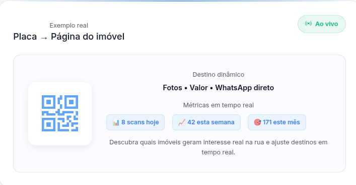

# QR MVP (Flask)



## Rodar local

1) Criar venv
python -m venv .venv

2) Ativar
- mac/linux: source .venv/bin/activate
- windows: .venv\Scripts\activate

3) Instalar deps
pip install -r requirements.txt

4) Configurar env
Copie .env.example para .env e ajuste se quiser.

5) Rodar
python app.py

## Acessos
- Portal: http://127.0.0.1:5000/login
- Redirect: http://127.0.0.1:5000/r/QR-001


# Operação

### Matando processos
```bash
fuser -k 5000/tcp
```